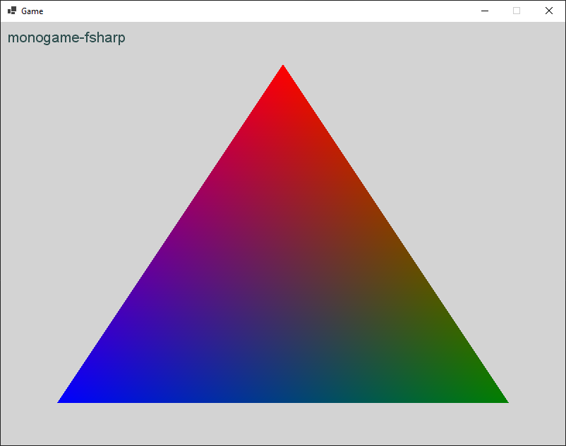

# monogame-fsharp

A starting point for an F# MonoGame project using MonoGame 3.8 plus .NET Core 3.1, Paket and FAKE 5.

MonoGame content is built by the [MGCB](https://docs.monogame.net/articles/tools/mgcb.html) local dotnet tool, triggered using a FAKE script.

## Prerequisites

- [.NET Core SDK 3.1](https://dotnet.microsoft.com/download/)

## Building and running

First run `dotnet tool restore` as a one-off.

Then use `dotnet fake build -t run` to build the content and executable and run it locally.

You should see a window like this:

